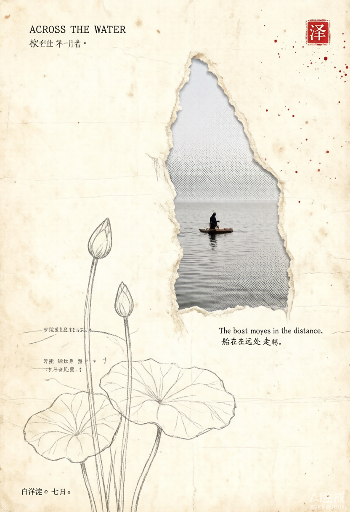
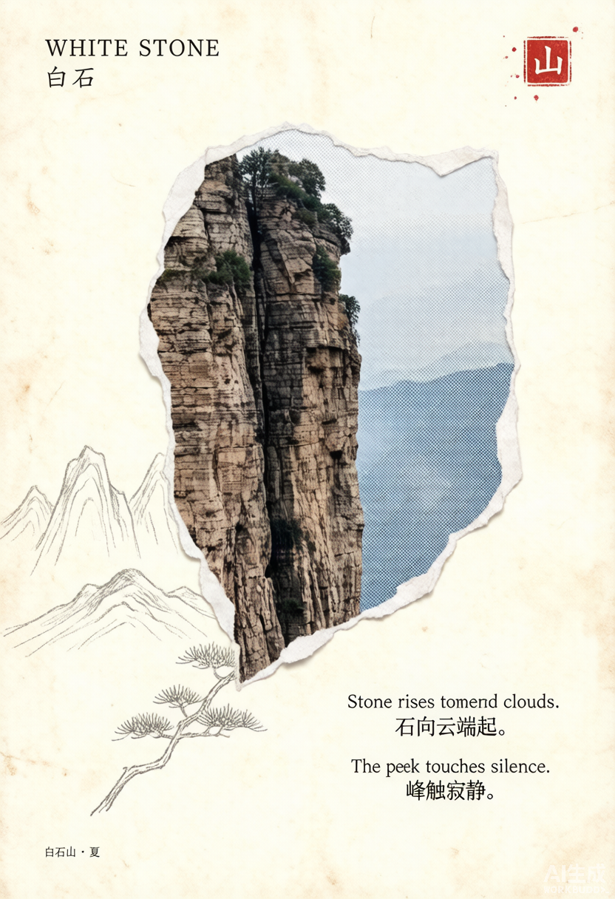
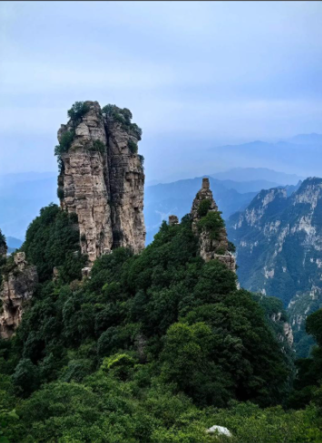

# vintage-paper-collage-zine

> **上传一张照片，自动生成极简复古撕纸拼贴独立杂志海报**




## 功能

本技能（WorkBuddy Skill）将任意照片转化为**极简复古纸拼贴风格**的独立杂志海报：

| 特性 | 说明 |
|------|------|
| **撕纸洞口** | 不规则撕裂边缘 + 真实纸纤维，露出照片局部 |
| **手绘线稿** | 铅笔植物/山体轮廓线从洞口"生长" |
| **米黄旧纸** | #F0E4C8 暖黄底色 + 老化斑点 + 折痕 |
| **中英双语标题** | 打字机/衬线字体，自动生成文学感文案 |
| **朱红印章** | 右上角方形印章 + 墨点飞溅 |
| **智能叙事提取** | 自动分析照片核心主体/环境/情绪，提炼最有叙事感的局部 |

## 安装

### 方式一：直接下载
1. 下载本仓库的 zip 包并解压
2. 将 `vintage-paper-collage-zine` 文件夹放入 `~/.workbuddy/skills/` 目录
3. 重启 WorkBuddy

### 方式二：Git 克隆
```bash
git clone https://github.com/iithink88/vintage-paper-collage-zine.git ~/.workbuddy/skills/vintage-paper-collage-zine
```

## 使用方法

在 WorkBuddy 对话中：
- 上传一张照片，要求"用 vintage-paper-collage-zine 风格做一张海报"
- 或直接说："把这张照片做成极简复古杂志海报"

技能会自动：
1. 分析照片的核心主体、环境和情绪
2. 提取最有叙事感的局部（不是完整照搬原图）
3. 重新设计摄影碎片、手绘线稿、旧纸留白和文字的关系
4. 自动创作简短、克制的中英文标题与文案
5. 生成最终海报图片

## Demo 示例

### 白洋淀 · 水一方
| 源照片 | 生成结果 |
|--------|----------|
|  |  |

### 白石山 · 白石
| 源照片 | 生成结果 |
|--------|----------|
|  |  |

## 文件结构

```
vintage-paper-collage-zine/
├── SKILL.md                          # 技能主文件（工作流+规则）
├── references/
│   └── prompt-template.md            # 可复用的 Prompt 模板
├── assets/
│   └── examples/
│       └── water-and-distance.png    # 内置示例图
└── demo/
    ├── baiyangdian-source.png        # 白洋淀源照
    ├── baiyangdian-result.png        # 白洋淀成品
    ├── baishishan-source.png         # 白石山源照
    └── baishishan-result.png         # 白石山成品
```

## 视觉语言来源

融合了两种设计风格的精华：
- **photo-abstract-editorial** — 照片局部提取 + 抽象编辑面板
- **gc-minimal-zine-poster-v0-1** — 极简 zine 海报 + 大留白 + 旧纸质感

在此基础上增加了：**撕纸洞口 + 手绘铅笔线稿 + 朱红印章 + 中英双语打字机排版**。

## License

MIT
